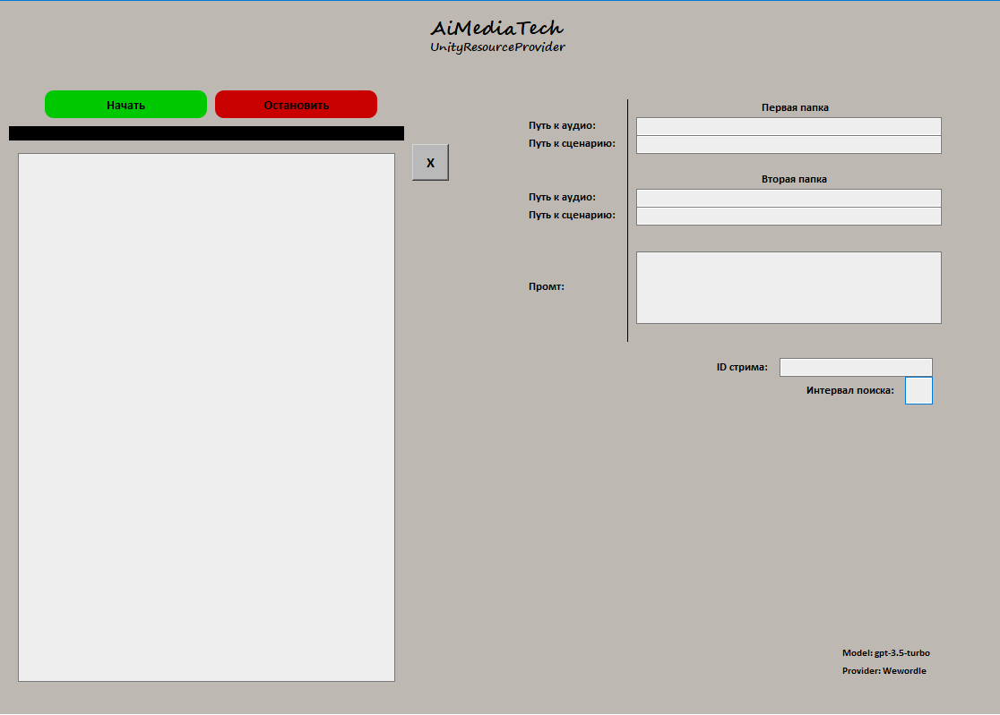

# amt-urp-ui
AiMediaTech Unity Resourse Provider<br>
Ui for Unity resources provider<br>
<b>Start -> <a href="https://github.com/xtekky/gpt4free">g4f</a> -> <a href="https://github.com/litagin02/rvc-tts-webui">rvc-tts-webui</a> -> Output</b><br><br>
A program for generating resources for the Unity project. Soft uses several neural networks.<br> 
The <b>gpt-3.5-turbo/gpt-4</b> models are used to generate the script. A complete list of available models and providers:<br><br>
<b>
    AItianhu,
    Acytoo,
    Aichat,
    Ails,
    Aivvm,
    Bard,
    Bing,
    ChatBase,
    ChatgptAi,
    ChatgptLogin,
    CodeLinkAva,
    DeepAi,
    H2o,
    HuggingChat,
    Opchatgpts,
    OpenAssistant,
    OpenaiChat,
    Raycast,
    Theb,
    Vercel,
    Vitalentum,
    Wewordle,
    Ylokh,
    You,
    Yqcloud.
</b>
<br><br>
After preparing the script, the <b>RVC-TTS-WEBUI</b> API is used to voice the characters' lines and saves the files to the specified folder.<br>
<b>You need to have the RVC-TTS-WEBUI server running for the application to work correctly.</b> Instructions for installing and starting the server can be found at the <a href="https://github.com/litagin02/rvc-tts-webui">link</a>.<br>
For optimal generation speed, you need a GTX1660 SUPER or better video card.

# Install
```
# Copy files on your PC
git clone https://github.com/Merzoit/amt-urp.git
# Go to actual folder
cd amt-urp-ui

# Create virtual environment
python -m venv venv
# Activate environment
venv\Scripts\activate

# Install requirements
pip install -r requirements.txt
```
# Settings
After installing the application and its dependencies, set the necessary settings.<br>
<b>amt-urp/settings.py</b>
```
# Indicate your Donation Alerts Api key
DA_TOKEN = "your API key" 
# Indicate your YouTube API key
YT_TOKEN = "your API key"
```
You can change provider<br>
<b>amt-urp/core.py</b>
```
def request_for_gpt(self, promt):
    """
    Метод отправки запроса к gpt.
    Возвращает строку сценария.
    """
    response = g4f.ChatCompletion.create(
        model = "gpt-3.5-turbo", # Indicate GPT model
        provider = g4f.Provider.Aichat, # Indicate GPT Provider
        messages = [{"role": "user", "content": promt}],
        auth = True,
        #stream = True,
    )
```
# Start app
```
venv\Scripts\activate
python main.py
```
After launching the application it will open UI.


